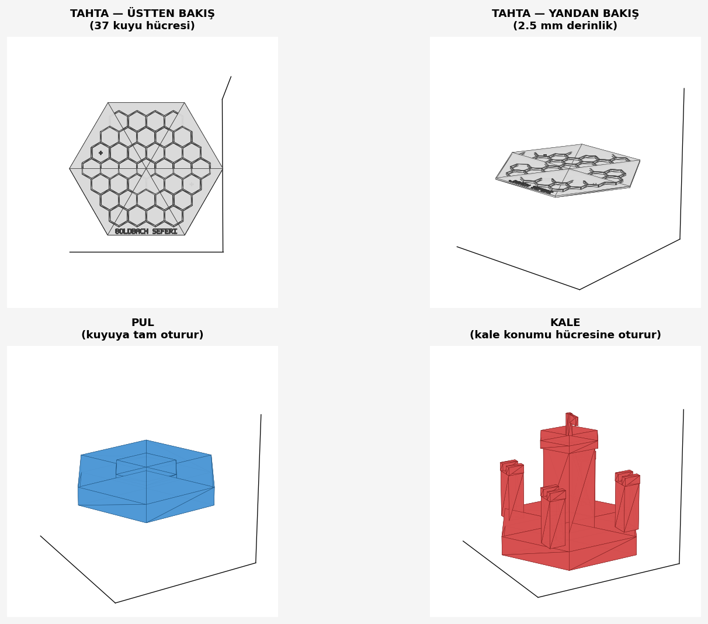

# Goldbach Seferi — 3D Baskı Dosyaları

Bu klasör, **Bambu Lab A1** (veya A1 Combo) ile basabileceğiniz oyun parçalarının
3D modellerini içerir. Bambu Studio (veya OrcaSlicer, Cura gibi diğer dilimleyiciler)
ile doğrudan kullanılabilir.

## 📁 Dosyalar

| Dosya | Açıklama | Boyut |
|---|---|---|
| `tahta.stl` | Oyun tahtası (3 halka, 37 hücre + **"GOLDBACH SEFERI" yazısı**) | 190 × 164.5 × 4.3 mm |
| `pul.stl` | Oyuncu pulu (kuyuya tam oturur, kaymaz) | 20 × 24 × 3.6 mm |
| `kale.stl` | Kale figürü (kuyuya oturan taban + 4 kule + bayrak) | 20 × 24 × 21 mm |
| `generate_stl.py` | Modelleri yeniden üreten Python scripti |  |
| `preview.py` | Önizleme görüntüsü oluşturan Python scripti |  |
| `onizleme.png` | 3D model önizlemesi |  |

## 🖼 Önizleme



## 🖨 Bambu Studio'da Nasıl Kullanılır

1. **Bambu Studio'yu açın**
2. **Dosya → İçe Aktar (Import) → 3MF/STL/STEP/OBJ** menüsüne gidin
3. İçe aktarılacak dosyayı seçin (örn. `tahta.stl`)
4. Model baskı tablasında görünecek
5. Sağ panelden ayarları yapın ve **Dilimle (Slice)** butonuna basın
6. **Baskıya Gönder** ile yazıcıya gönderin

> 💡 **İpucu:** Birden fazla pulu aynı anda basmak için: pul dosyasını ekledikten sonra
> sağ tıklayıp **Çoğalt (Clone)** seçeneğini kullanın. Tek baskıda 10-20 pul basabilirsiniz.

## ⚙ Önerilen Baskı Ayarları

| Ayar | Değer | Açıklama |
|---|---|---|
| **Filament** | PLA | En kolay basılan, projeniz için yeterli |
| **Nozzle** | 0.4 mm | A1'in standart ucu |
| **Katman yüksekliği** | 0.20 mm | Hız ve kalite dengesi |
| **Doluluk (Infill)** | %15 | Yeterince güçlü, hızlı baskı |
| **Doluluk deseni** | Gyroid veya Grid | Yeterli dayanım |
| **Destek (Support)** | **GEREK YOK** | Tüm parçalar düz tabanlı |
| **Brim** | Yok (veya 5 mm) | Pul/kale için brim önerilebilir |
| **Plaka sıcaklığı** | 55°C (PLA) | Standart |
| **Nozzle sıcaklığı** | 215°C (PLA) | Standart |

## 🎨 Renk Önerileri (AMS Lite ile)

Eğer **A1 Combo** (AMS Lite ile) kullanıyorsanız:

| Parça | Önerilen renk |
|---|---|
| Tahta | Beyaz veya açık gri (parçaların kontrast oluşturması için) |
| Pul (Mavi oyuncu) | Mavi PLA |
| Pul (Kırmızı oyuncu) | Kırmızı PLA |
| Kale (Mavi oyuncu) | Mavi veya koyu mavi |
| Kale (Kırmızı oyuncu) | Kırmızı veya bordo |

**Tek renk yazıcı** (sadece A1) kullanıyorsanız: aynı dosyaları farklı renk filamentle
ayrı ayrı yazdırabilirsiniz.

## ⏱ Tahmini Baskı Süreleri (A1, 0.20 mm katman)

| Parça | Süre | Filament |
|---|---|---|
| Tahta | ~2 saat 30 dakika | ~30 g |
| 1 pul | ~10 dakika | ~2 g |
| 1 kale | ~45 dakika | ~8 g |

**Demo için tavsiye edilen baskı:**
- 1 × tahta
- 8 × mavi pul + 8 × kırmızı pul
- 1 × mavi kale + 1 × kırmızı kale

**Toplam süre:** ~5-6 saat | **Toplam filament:** ~80 g

## 🏷 Taban Üstündeki Yazı

Tahtanın alt kısmında, hücrelerin altındaki düz alanda **"GOLDBACH SEFERI"**
yazısı kabartma olarak yer alıyor (taban yüzeyinden 0.8 mm yükseklikte).

Yazı boyutları:
- Piksel boyutu: 0.85 mm (5×7 piksel font)
- Harf boyutu: 4.25 × 5.95 mm
- Toplam yazı genişliği: ~85 mm

> 💡 Bambu Studio'da yazıyı farklı renkte basmak isterseniz: AMS Lite ile
> yazı seviyesinde renk değiştirip aynı baskıda iki renkli yapabilirsiniz.

## 📐 Tahtaya Pul Yerleştirme — Kuyu Sistemi

Tahta artık **gerçek kuyu** sistemine sahip. Her hücre 2.5 mm derinliğinde
hexagonal bir oyuktur. Pul bu oyuğa **tam oturur ve kaymaz**.

| Ölçü | Değer |
|---|---|
| Hücre dış yarıçapı (köşeden köşeye) | 13 mm |
| Hücre iç genişliği (flat-to-flat) | ~21 mm |
| Pul yarıçapı | 11.79 mm |
| Pul flat-to-flat | ~20.4 mm |
| Boşluk (rahat takıp çıkarma için) | ~0.4 mm her yandan |
| Kuyu derinliği | 2.5 mm |
| Pul kalınlığı | 3 mm (0.5 mm dışarı çıkar = parmakla rahat tutulur) |
| Kuyu duvar kalınlığı | 1.4 mm |

Kale figürü pul ile **aynı taban boyutuna** sahip — herhangi bir hücreye
oturur, ama özellikle tahtadaki **+ işaretli** kale konumlarına yerleştirilmesi
önerilir (her oyuncu kendi rengine göre).

## 🔧 Modelleri Özelleştirmek İsterseniz

`generate_stl.py` dosyasının başındaki parametreleri değiştirip yeniden çalıştırın:

```bash
cd 3d_modeller
python3 generate_stl.py
```

Örneğin:
- `RINGS = 4` → 4 halkalı tahta (61 hücre)
- `HEX_R = 15.0` → daha büyük hücreler
- `TILE_THICKNESS = 5.0` → daha kalın pul

## 🆘 Sorun Giderme

**"STL dosyası bozuk" hatası alıyorum:**
→ `generate_stl.py` scriptini yeniden çalıştırarak dosyaları yeniden üretin.

**Pul, hücreye sığmıyor:**
→ `TILE_R` değerini biraz azaltın (örn. 10.0 → 9.5) ve yeniden üretin.

**Kale çok yüksek/alçak:**
→ `CASTLE_TOWER_H` değerini değiştirin.

**Tahta yazıcıma sığmıyor:**
→ A1 256×256 mm. Mevcut tahta 155×134 mm, sorun olmaz.
   Daha küçük istiyorsanız `HEX_R` değerini azaltın.
